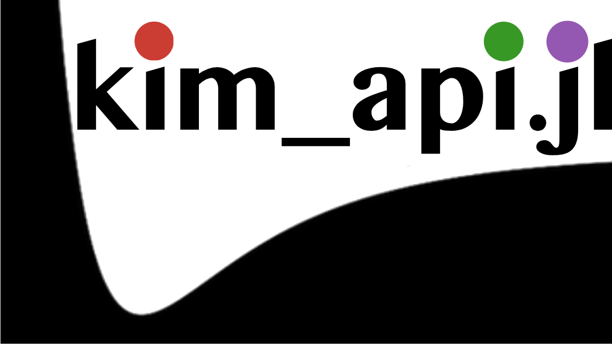

# kim_api.jl

<p align="center">

</p>

Julia interface to the [KIM-API](https:https://kim-api.readthedocs.io) (Knowledgebase of Interatomic Models). Think of it as the Julia equivalent of the KIMPY Python package.

## Installation

```julia
using Pkg
Pkg.develop(path="/path/to/kim_api.jl")
```

## Quick Start

```julia
using kim_api
using StaticArrays

# Create a model
model = kim_api.KIMModel("SW_StillingerWeber_1985_Si__MO_405512056662_006")

# Setup atoms
positions = [SVector(0.0, 0.0, 0.0), SVector(2.7, 2.7, 0.0)]
species = ["Si", "Si"]
cell = [5.43 0.0 0.0; 0.0 5.43 0.0; 0.0 0.0 5.43]
pbc = [true, true, true]

# Calculate
results = model(species, positions, cell, pbc)
energy = results[:energy]
forces = results[:forces]
```

## Features

- Access to all KIM models
- Automatic neighbor list generation
- Support for periodic boundary conditions
- Multiple unit systems (metal, real, SI, CGS, electron)

## Requirements

- Julia 1.10+
- KIM-API library (for model calculations)
- NeighbourLists.jl, StaticArrays.jl


## TODO
- More tests 
- Documentation
- ML models support (Need to enable ghost atoms neighbor list generation)

## License

MIT